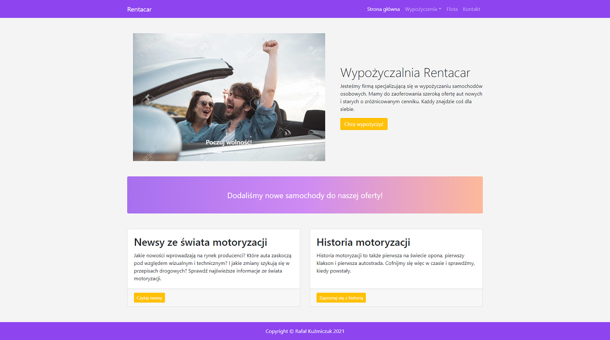
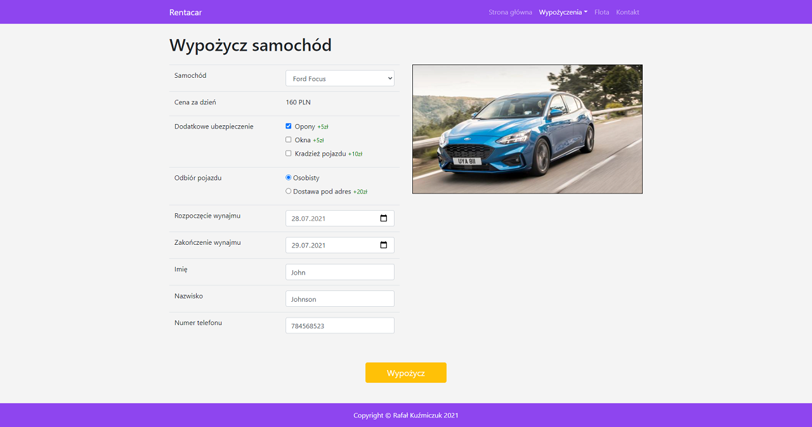
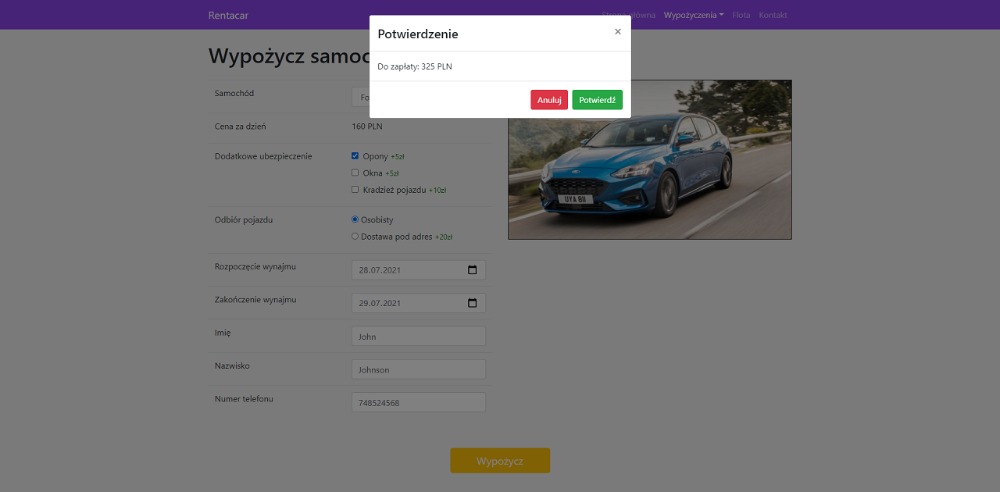
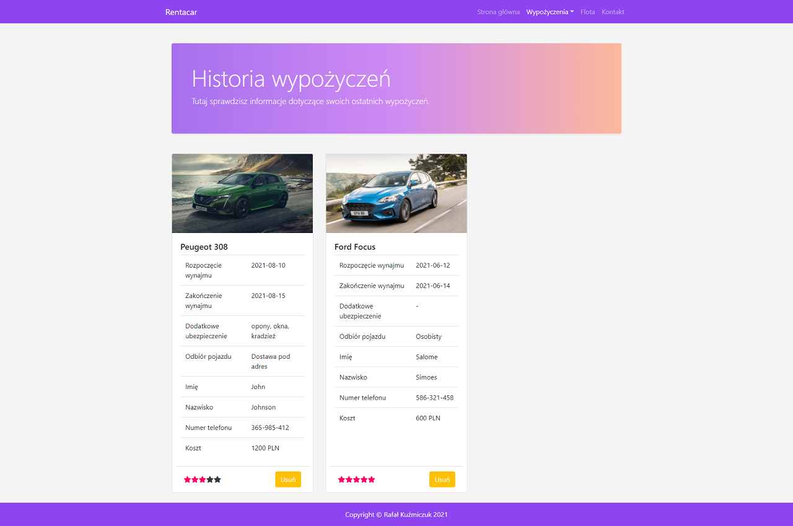
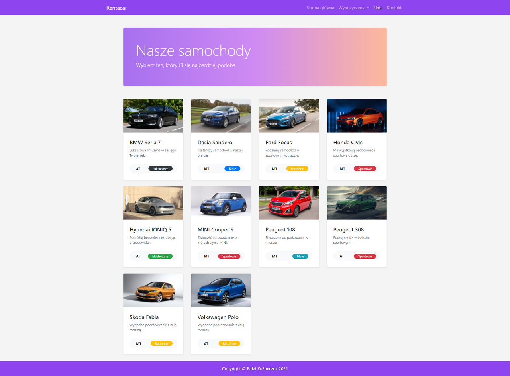
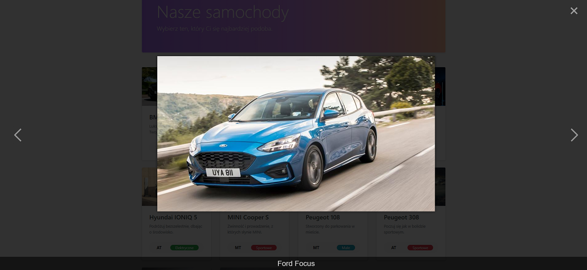
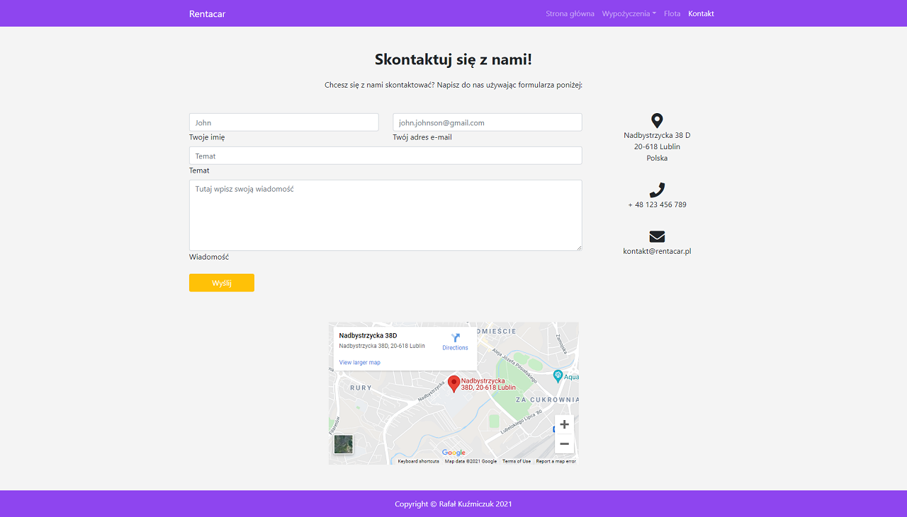

# Car rental company website

This is my assignment for the Basics of Internet Applications course. It is a responsive MPA website based on HTML, CSS,
Bootstrap and JS. I used jQuery library for most things, since we only had one lesson about it, so I decided it was not
enough and wanted to practise it more. It has extensive car rent form with full validation in JS. I use local storage
for storing the rents in JSON format. You can view the rent history, review each rent using star rating or delete them
individually. I use fetch API calls for getting data in JSON format.

## Preview:

